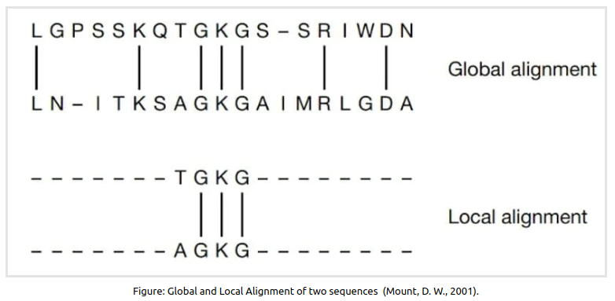
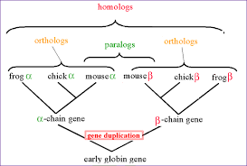

# Introducción a las alineaciones

## ¿Qué es una alineación de secuencias?

Una alineación de secuencias (específicamente alineación por pares) significa **organizar dos secuencias de forma que las regiones con similitudes se alineen**. Por ejemplo, la alineación de `GATTACA` y `GATCA` podría verse así:

```
GATTACA
||| |
GATCA--
```

A simple vista, las alineaciones suelen tener sentido de forma intuitiva, pero cuidado, ya que nuestra intuición puede ser engañosa. Y cada persona puede intuir una alineación diferente.

Nuestro cerebro está predispuesto a ver patrones y similitudes siempre que sea posible. Una vez que percibimos una similitud, nos resulta difícil reconocer otras alternativas que podrían ser igual de buenas (o incluso mejores) que la que estamos observando. Es difícil “dejar de ver” un patrón. Por ejemplo, podríamos haber dispuesto las secuencias así:

```
GATTACA
|||  ||
GAT--CA
```

o también así:

```
GATTACA
|| | ||
GA-T-CA
```

Aquí vemos dos alineaciones más de las mismas secuencias que también parecen concordar bastante bien. Una vez que observamos un patrón, puede llevar un esfuerzo considerable notar que podríamos haber ordenado las letras de otras formas igual de válidas.

## ¿Para qué se usan las alineaciones?

Las alineaciones tienen dos aplicaciones principales:


## ¿Qué determina una alineación?

Cada alineación está determinada por dos factores:

1. **Algoritmo de alineación**: global, local o semi-global.
2. **Puntuación de alineación (parámetros)**: valores numéricos que ajustan la disposición.

| Recuerda siempre que:

- **Diferentes algoritmos suelen producir alineaciones diferentes para las mismas secuencias.**
- **Diferentes puntuaciones también suelen generar alineaciones distintas para las mismas secuencias.**

### ¿Cómo se generan las alineaciones?

Supón que tienes las siguientes alineaciones de `GATTACA` con `GATCA`:

```
GATTACA      GATTACA      GATTACA
|||.|        |||  ||      || | ||
GATCA--      GAT--CA      GA-T-CA
```

¿Cuál de estas es la alineación “mejor”, “correcta” o “significativa”?

La “mejor” alineación depende de cómo valoras la forma en que se alinean las bases. ¿Consideras que una discrepancia es menos perturbadora que los espacios vacíos? **El valor que asignes a una coincidencia, discrepancia o espacio vacío se denomina puntuación.**

## Concepto fundamental de la alineación:

No existe una alineación universalmente mejor. **Solo existe la mejor alineación relativa a una elección de puntuación.** Cambiar la puntuación generalmente cambia la alineación seleccionada como mejor. Los algoritmos de alineación encuentran la disposición que maximiza la puntuación total de la alineación.

Los algoritmos de alineación aceleran el proceso de seleccionar la alineación con la mejor puntuación. Puedes pensar en los alineadores como métodos para evaluar rápidamente todas las combinaciones posibles y luego seleccionar las alineaciones con la puntuación más alta.

## ¿Cómo funciona la puntuación de alineación?

Las puntuaciones son valores, tanto positivos como negativos, que un algoritmo asignará a varias bases al alinearlas de cierta manera. Un alineador intenta crear una disposición que maximice la puntuación.

Por ejemplo, podríamos elegir las siguientes puntuaciones:

- 1 punto por coincidencia.
- -1 punto por discrepancia.
- -2 puntos por abrir un espacio.
- -1 punto por extender un espacio ya abierto.

Luego le indicamos al alineador que encuentre las mejores alineaciones utilizando estas puntuaciones. Con este sistema, las alineaciones se puntuarían así (las puntuaciones se muestran en la parte inferior):

```
GATTACA      GATTACA      GATTACA
|||.|        |||  ||      || | ||
GATCA--      GAT--CA      GA-T-CA

   0            2             1
```

Con esta puntuación, la segunda alineación tiene la puntuación más alta (2) y se considera la "mejor" alineación.

Cuando las secuencias tienen diferentes longitudes, a menudo queremos encontrar la secuencia más larga que cubra la secuencia más corta. Para ajustar esto, aplicamos una corrección que no penaliza los espacios al final de ninguna de las secuencias. Si aplicamos esta corrección, las puntuaciones serían:

```
GATTACA      GATTACA      GATTACA
|||.|        |||  ||      || | ||
GATCA--      GAT--CA      GA-T-CA

   3            2             1
```

Ahora, la primera alineación tiene la puntuación máxima y se convierte en la "mejor alineación". Otros cambios en la puntuación podrían afectar qué alineación se considera mejor.

## ¿Cómo elijo las puntuaciones?

En la mayoría de los casos, se comienza con puntuaciones conocidas, calculadas a partir de la tasa de sustitución a lo largo de la historia evolutiva. Existen varios esquemas de puntuación alternativos creados a partir de estas observaciones. Para obtener matrices de puntuación recomendadas, puedes consultar, por ejemplo:

```bash
curl -O ftp://ftp.ncbi.nlm.nih.gov/blast/matrices/NUC.4.4
cat NUC.4.4
```

El archivo muestra que la contribución de puntuación por hacer coincidir una A con una A es de 5 puntos, mientras que la contribución de una coincidencia entre una A y una T es de -4 puntos (es decir, una penalización de 4 puntos).

Al observar visualmente la matriz de puntuación anterior, ya podemos deducir que favorecerá las discrepancias. Por ejemplo, generará fácilmente una alineación con discrepancias de la siguiente forma:

```bash
pip install bio --upgrade

bio align ATG ACG --local -match 5 -mismatch 4
```

lo cual produce:

```
ATG
|.|
ACG
```

La segunda coincidencia G/G añadirá 5 puntos, y esta contribución superará la penalización de -4 introducida por la discrepancia. Si, en cambio, escribiéramos:

```bash
bio align ATG ACG --local -match 4 -mismatch 5
```

la alineación local sería simplemente:

```
A
|
A
```

La alineación no puede extenderse más hacia la izquierda, ya que **"no vale la pena"** añadir una penalización de -5 cuando la recompensa es solo de 4.

Elegir la matriz adecuada, especialmente para secuencias de proteínas, es aún más complicado.

## Tipos de matrices de puntuación

Existen dos tipos de matrices de puntuación: para nucleótidos y para proteínas. Las matrices de proteínas vienen en muchas variantes, calculadas bajo diferentes suposiciones sobre lo que significa la similitud. Además, las matrices de puntuación pueden estar normalizadas o no, lo cual debe tenerse en cuenta al comparar puntuaciones.

## Otras propiedades de las matrices de puntuación

Las matrices de puntuación generalmente no incluyen penalizaciones para los espacios. La penalización por extensión de un espacio es típicamente mucho menor que la penalización por abrir uno, lo que tiene una justificación biológica.

## Cómo se muestran las alineaciones

No existe un formato universal para mostrar alineaciones, pero comúnmente usamos un formato visual con caracteres adicionales para interpretarlas:

- El carácter `-` indica un espacio.
- El carácter `|` muestra una coincidencia.
- El carácter `.` muestra una discrepancia.

Ejemplo:

```
ATGCAAATGACAAAT-CGA
||||   |||.||.| |||
ATGC---TGATAACTGCGA
```

De las bases anteriores, 13 son iguales (13 identidades), 5 bases están ausentes (5 espacios), y 2 bases son diferentes (2 discrepancias).

Aquí tienes la traducción:

---

## ¿Importa cuál secuencia está en la parte superior?

Usualmente, a menos que se indique explícitamente lo contrario, leemos e interpretamos la alineación como si estuviéramos comparando la secuencia inferior con la superior.

```
ATGCAAATGACAAAT-CGA
||||   |||.||.| |||
ATGC---TGATAACTGCGA
```

Mientras que la palabra “espacio” es genérica y se refiere a cualquiera de las secuencias, si queremos ser más específicos, podríamos decir que la alineación anterior muestra tres eliminaciones de A y una inserción de G. La palabra “eliminación” significa que la segunda secuencia tiene bases faltantes en comparación con la primera.

Podríamos generar y mostrar esta misma alineación al revés:

```
ATGC---TGATAACTGCGA
||||   |||.||.| |||
ATGCAAATGACAAAT-CGA
```

Esta alineación se describiría ahora como una que contiene tres inserciones de A seguidas posteriormente de una eliminación de G en relación con la secuencia superior. La eliminación en una secuencia es una inserción en la otra; todo depende de lo que trata el estudio.

## Alineaciones globales y locales

Para ejecutar los ejemplos, instala el paquete `bio` desarrollado para este libro:

```bash
pip install bio --upgrade
```

Puedes leer más sobre cómo funciona el método `bio align` en [https://www.bioinfo.help/bio-align.html](https://www.bioinfo.help/bio-align.html).

### Nota importante sobre alineaciones

Los algoritmos de alineación en `bio align` utilizan la implementación de BioPython, ideal para uso interactivo y exploratorio al alinear secuencias relativamente cortas (de hasta aproximadamente 30 kb de longitud).

El software especializado en alineación genómica suele operar con órdenes de magnitud más rápidos, aunque ajusta características a cambio de esa mayor velocidad. Dependiendo de tus necesidades, es posible que desees usar uno de los numerosos alineadores disponibles, como: `blast`, `blat`, `fasta36`, `mummer`, `minimap2`, `lastz`, `lastal`, `exonerate`, `vsearch`, `diamond`, etc.

La gran cantidad de opciones de alineadores, junto con el enorme número de parámetros que cada alineador permite personalizar, muestra que las alineaciones son tareas complejas y multifacéticas.

### Cómo realizar una alineación con `bio`

Verifica que el script funcione con:

```bash
bio align THISLINE ISALIGNED
```

Esto imprimirá:

```
# seq1 (8) vs seq2 (9)
# pident=36.4% len=11 ident=4 mis=2 del=2 ins=3
# semiglobal: score=8.0 matrix=BLOSUM62 gapopen=11 gapextend=1

THISLI--NE-
--||..--||-
--ISALIGNED
```

La herramienta `bio align` está diseñada de tal manera que permite utilizar tanto cadenas de texto como nombres de archivos FASTA. Podemos obtener una matriz de puntuación diferente:

```bash
wget -nc ftp://ftp.ncbi.nlm.nih.gov/blast/matrices/BLOSUM30
```

Y luego usar la matriz de puntuación personalizada de la siguiente manera:

```bash
bio align THISLINE ISALIGNED --matrix BLOSUM30
```

Esto imprimirá:

```
# seq1 (8) vs seq2 (9)
# pident=36.4% len=11 ident=4 mis=2 del=2 ins=3
# semiglobal: score=13.0 matrix=BLOSUM30 gapopen=11 gapextend=1

THIS--LINE-
--||--..||-
--ISALIGNED
```

En los ejemplos a continuación, utilizaremos secuencias proteicas hipotéticas `THISLINE` e `ISALIGNED`, palabras reales que también resultan ser secuencias peptídicas válidas. Estas secuencias se utilizaron por primera vez con un propósito similar, aunque en un contexto diferente, en el libro *Understanding Bioinformatics* de Marketa Zvelebil y Jeremy Baum.

### ¿Qué es una alineación global?



Una alineación global busca maximizar las similitudes a lo largo de toda la longitud de las secuencias, lo que significa que intenta encontrar la mejor correspondencia de extremo a extremo para ambas secuencias. Esta técnica es especialmente útil cuando las secuencias tienen tamaños similares y queremos compararlas en su totalidad.

La herramienta `bio align`, por defecto, realiza una alineación semi-global. Esto significa que permite que haya "gaps" (huecos) al final de la secuencia de consulta (o "query") sin penalizarlos. En otras palabras, si al final de la consulta quedan bases sin alinear, no se les resta puntos. Este tipo de alineación es útil cuando queremos comparar una secuencia corta con una más larga, sin preocuparnos por los extremos.

**Por otro lado, cuando hacemos una alineación global, tratamos de alinear las dos secuencias en toda su longitud, de principio a fin.** En este caso, cada base de una secuencia debe estar alineada con una base de la otra secuencia, o si no hay coincidencia, se coloca un “gap” en la segunda secuencia.

Ejemplo: Imagina que tienes dos secuencias de ADN:

- Secuencia 1 (consulta): ACTG
- Secuencia 2: GACTGA

En una alineación semi-global, el programa puede hacer algo como esto:

```
   ACTG
   ||||
  GACTGA
```
Aquí, las bases coinciden sin importar que al final de la segunda secuencia haya más letras.

En cambio, en una alineación global, se alinea la totalidad de ambas secuencias y se usan “gaps” cuando es necesario para mantener la longitud. Así se vería:

```
 -ACTG-
  |||||
 GACTGA
```

Aquí, los huecos adicionales se agregan al final de la primera secuencia (`ACTG-`) para que coincida con la longitud de la segunda (`GACTGA`).

Usamos alineaciones globales cuando buscamos un arreglo que maximice las similitudes en toda la longitud de ambas secuencias:

```bash
bio align THISLINE ISALIGNED --global
```

eso imprime:

```
# seq1 (8) vs seq2 (9)
# pident=22.2% len=9 ident=2 mis=6 del=0 ins=1
# global: score=-7.0 matrix=BLOSUM62 gapopen=11 gapextend=1

THISLINE-
......||-
ISALIGNED
```

También podemos anular la brecha abierta y la penalización de extensión de la brecha:

```bash
bio align THISLINE ISALIGNED --global --open 7
```

ahora la alineación se ve así:

```
# seq1 (8) vs seq2 (9)
# pident=54.5% len=11 ident=6 mis=0 del=2 ins=3
# global: score=6.0 matrix=BLOSUM62 gapopen=5 gapextend=1

THIS-LI-NE-
--||-||-||-
--ISALIGNED
```

Tenga en cuenta cuán radicalmente diferente es la segunda alineación de la primera. Todo lo que hicimos fue reducir la pena de abrir una brecha `11`` to7en`. La alineación es más larga pero tiene más huecos. La compensación es fácilmente evidente.

Recuerde, una alineación encuentra la disposición que maximiza la puntuación de recompensas y penalizaciones en todas las secuencias.

### ¿Qué es una alineación local?

**Las alineaciones locales se utilizan cuando necesitamos encontrar la región de similitud máxima entre dos secuencias.** Esto es particularmente útil cuando solo una parte de las secuencias es relevante, por ejemplo, cuando una proteína contiene dominios específicos similares a otras proteínas. Al realizar alineaciones locales, los algoritmos buscan el intervalo de puntuación más alto (es decir, la región donde las secuencias son más similares) y lo reporta. Así, una alineación local puede ser una pequeña parte de cada secuencia, en lugar de intentar alinear todos los elementos de principio a fin.

```bash
bio align THISLINE ISALIGNED --local
```

Cuando se ejecuta como arriba, la alineación local generada con los parámetros predeterminados será sorprendentemente corta:

```
# seq1 (2) vs seq2 (2)
# pident=100.0% len=2 ident=2 mis=0 del=0 ins=0
# local: score=11.0 matrix=BLOSUM62 gapopen=11 gapextend=1

NE
||
NE
```

El algoritmo nos dice que estos dos aminoácidos coincidentes producen la puntuación más alta posible (11 en este caso) y cualquier otra alineación local entre las dos secuencias producirá una puntuación peor que 11.

Podemos usar otras matrices de puntuación como se muestra en ftp://ftp.ncbi.nlm.nih.gov/blast/matrices/, muchos de estos están incluidos con bio.

```
#  DNA matrices
# This matrix is the "standard" EDNAFULL substitution matrix.
wget ftp://ftp.ncbi.nlm.nih.gov/blast/matrices/NUC.4.4

# Protein matrices
# Get the BLOSUM30, BLOSUM62, and BLOSUM90 matrices.
wget -nc ftp://ftp.ncbi.nlm.nih.gov/blast/matrices/BLOSUM30
```

Obsérvese cómo la alineación local se ve afectada por el esquema de puntuación.

```
bio align THISLINE ISALIGNED -matrix BLOSUM30 --local
Usando el BLOSUM90 el esquema de puntuación produce una alineación mucho más larga:

# seq1 (4) vs seq2 (4)
# pident=50.0% len=4 ident=2 mis=2 del=0 ins=0
# local: score=15.0 matrix=BLOSUM30 gapopen=11 gapextend=1

LINE
..||
IGNE
```

### ¿Cómo elegimos la matriz correcta?

La matriz de sustitución define la puntuación de cada coincidencia y desajuste entre elementos de las secuencias (aminoácidos o nucleótidos), lo cual afecta drásticamente la alineación. Aquí tienes algunos ejemplos:

- **Matrices para ADN:** Existen matrices específicas para alineaciones de secuencias de ADN, como EDNAFULL, que es una matriz estándar para comparar nucleótidos.
- 
- **Matrices para proteínas:** Para proteínas, se utilizan matrices BLOSUM (p. ej., BLOSUM30, BLOSUM62, BLOSUM90) o PAM. Cada matriz tiene sus propias particularidades en cuanto a la puntuación de coincidencias y desajustes. Generalmente:
   - **BLOSUM30** es útil para secuencias distantes (más permisiva con desajustes).
   - **BLOSUM90** es más restrictiva y adecuada para secuencias más similares.

Selección de la Matriz de Puntuación de Similitud Correcta por William Pearson, el autor del programa FASTA.

Aquí hay algunas líneas del resumen:

Si bien las matrices “deep” proporcionan búsquedas de similitud muy sensibles, también requieren alineaciones de secuencia más largas y, a veces, pueden producir una sobreextensión de alineación en regiones no homólogas. Las matrices de puntuación más superficiales son más efectivas cuando se buscan dominios proteicos cortos, o cuando el objetivo es limitar el alcance de la búsqueda a secuencias que probablemente sean ortólogas entre organismos recientemente divergentes.




Del mismo modo, en las búsquedas de ADN, los parámetros de coincidencia y desajuste en las búsquedas de ADN reflejan una especie de "retroceso evolutivo" o antigüedad de la similitud, estableciendo también límites de dominio en función de las probabilidades de cambio entre nucleótidos a lo largo del tiempo.

### ¿Cómo “veo” la matriz?

`bio align` imprimirá la matriz (cuando utilice valores incorporados):

```bash
bio align -matrix PAM250 | head -15
```

impresiones:

```
#
# This matrix was produced by "pam" Version 1.0.6 [28-Jul-93]
#
# PAM 250 substitution matrix, scale = ln(2)/3 = 0.231049
#
# Expected score = -0.844, Entropy = 0.354 bits
#
# Lowest score = -8, Highest score = 17
#
   A  R  N  D  C  Q  E  G  H  I  L  K  M  F  P  S  T  W  Y  V  B  Z  X  *
A  2 -2  0  0 -2  0  0  1 -1 -1 -2 -1 -1 -3  1  1  1 -6 -3  0  0  0  0 -8
R -2  6  0 -1 -4  1 -1 -3  2 -2 -3  3  0 -4  0  0 -1  2 -4 -2 -1  0 -1 -8
N  0  0  2  2 -4  1  1  0  2 -2 -3  1 -2 -3  0  1  0 -4 -2 -2  2  1  0 -8
D  0 -1  2  4 -5  2  3  1  1 -2 -4  0 -3 -6 -1  0  0 -7 -4 -2  3  3 -1 -8
C -2 -4 -4 -5 12 -5 -5 -3 -3 -2 -6 -5 -5 -4 -3  0 -2 -8  0 -2 -4 -5 -3 -8
...
```

### ¿Por qué los valores de puntuación son números enteros?

En las matrices de sustitución (como BLOSUM o PAM), los valores de puntuación representan la probabilidad relativa de que una sustitución específica ocurra durante la evolución de las secuencias. Esta probabilidad se expresa en términos de logaritmos en base 2 (log2), que son más manejables en alineaciones de secuencias.

**Logaritmos y Probabilidades en Puntuaciones**

Los valores de puntuación se obtienen de la probabilidad de que dos aminoácidos específicos se sustituyan entre sí en relación con la probabilidad de que se alineen al azar.

Al representar las puntuaciones en logaritmos base 2 (log2), podemos expresar el cambio en probabilidad en términos de potencias de 2. Esto facilita la interpretación de las puntuaciones.

Así, una puntuación de 3 implica una probabilidad de sustitución de 2^3 = 8 veces más probable que al azar, mientras que una puntuación de 5 implica una probabilidad de 2^5 = 32 veces. La sustitución con puntuación 3 es cuatro veces más probable que una con puntuación 5.

### ¿Qué es una alineación semi-global?

Las alineaciones semi-globales (también conocidas como global-local, glocal) son un cruce entre las alineaciones globales y locales.

Las alineaciones semi-globales intentan alinear completamente una secuencia más corta contra una más larga (referencia). El objetivo se logra estableciendo las sanciones de brecha final en cero.
